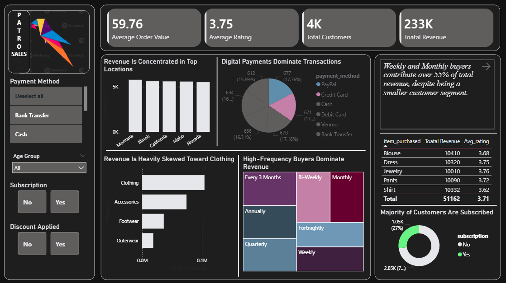

# patro-customer-sales-dashboard
Power BI dashboard analyzing PATRO customer sales, revenue drivers, payment behavior, and repeat purchase patterns
# 📊 PATRO Sales Dashboard (Power BI)

## 📌 Project Overview
This project is an interactive **Power BI dashboard** built to analyze customer purchasing behavior and identify key revenue drivers from transactional retail data. The dashboard focuses on **insight-driven storytelling**, highlighting where revenue comes from, how customers pay, and which customer segments contribute the most.

---

## 🎯 Key Insights
- Revenue is **concentrated in top locations**, indicating geographic dependency.
- **Digital payments dominate transactions**, showing strong preference for online payment methods.
- **Clothing generates the highest revenue**, making it the most valuable product category.
- **High-frequency buyers (Weekly & Monthly)** contribute over **55% of total revenue**, despite being a smaller segment.
- A **majority of customers are subscribed**, supporting the impact of subscription-based engagement.

---

## 🛠 Tools & Technologies
- Power BI Desktop  
- DAX (Measures + Dynamic Titles)  
- Data Visualization & Dashboard Design  

---

## 📌 Dashboard Features
### KPI Cards
- Total Revenue  
- Total Customers  
- Average Order Value  
- Average Rating  

### Slicers
- Payment Method  
- Age Group  
- Subscription Status  
- Discount Applied  

### Other Highlights
- Insight-driven chart titles and annotations  
- Clean dark theme layout for better readability  

---

## 📷 Dashboard Preview

  
